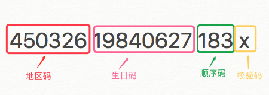
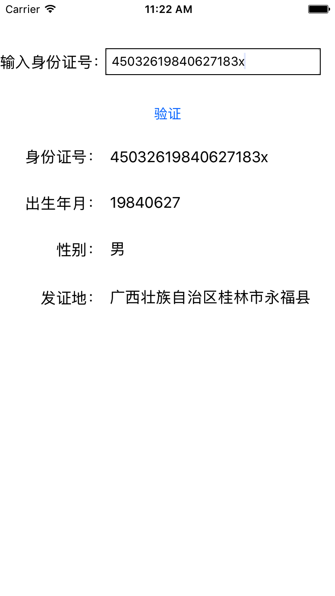

# IDService
一个检测身份证件合法性以及解析的demo

# 背景
大陆18位身份证(第二代身份证)结构如下图所示：



身份证号码是一组具有特征组合码，由十七位数字本体码

排列顺序呢从左至右依次为：六位数字地区码、八位数字生日吗、三位数字顺序码和一位数字校验码。
顺序码奇数为男，偶数为女。

# 校验方法：

1.先对前17位数字的权求和

```objectivec
S = Sum(Ci * Vi), i = 0, ... , 16

Ci:表示身份证号码上第i位置的数字值

Vi:表示第i位置上的“加权因子”
加权因子Vi: 7 9 10 5 8 4 2 1 6 3 7 9 10 5 8 4 2
```

2.计算模（固定算法）

```objectivec
Y = mod(S, 11)
```

3.将计算出来的模Y与对应的校验码校验

```objectivec
Y: 0 1 2 3 4 5 6 7 8 9 10
(通过Y取得对应校验码与身份证的第18位校验)
校验码: 1 0 X 9 8 7 6 5 4 3 2
```

效果如下：




[身份证地区码](http://www.stats.gov.cn/tjsj/tjbz/xzqhdm/)来自国家统计局
